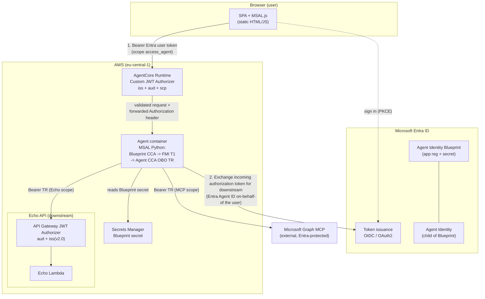

# Entra Agent ID from AWS AgentCore — PoC

A proof-of-concept that invokes an **AWS Bedrock AgentCore**-hosted AI agent from an
**Entra-secured single-page app**, where the agent holds its **own Microsoft Entra
Agent Identity** and performs the Entra Agent ID **FMI/OBO token exchange in-process**
(MSAL Python) to call downstream Entra-protected resources on behalf of the signed-in
user.

A browser SPA signs the user in with MSAL.js and sends their Entra access token (Bearer,
header-only) to the AgentCore Runtime. AgentCore's **built-in JWT authorizer** validates
that token at the front door (issuer + audience + scope) before any container code runs.
Inside the container, the agent runs a two-stage Entra Agent ID exchange — **FMI**
(Blueprint → Agent Identity) then **OBO** (user-delegated) — using **MSAL Python**, and
calls the downstream **Echo API** and (optionally) the **Microsoft Graph MCP** server with
the resulting user-bound tokens.

> **in-process via MSAL Python**. (An API Gateway HTTP API *is* used — but only as the
> front door for the downstream Echo API, see [What's deployed](#whats-deployed-aws).)

---

## Architecture topology

The diagram reflects the **deployed** stack. The agent never receives a credential it can
hand to the model — see [Security notes](#security-notes).

---

## Components

| Component | Role | Where it runs | Tech |
|---|---|---|---|
| **SPA** (`spa/`) | User sign-in + chat UI; acquires the Entra user token and invokes the AgentCore Runtime (header-only Bearer) | Browser (static files; nginx container for local serving) | MSAL.js 3.28.1, Bootstrap 5.3.3, `marked` + DOMPurify |
| **AgentCore Runtime** (`AgentRuntime`) | Hosts the agent; its **built-in JWT authorizer** validates the inbound Entra token before the container runs | AWS Bedrock AgentCore (managed), eu-central-1 | `AWS::BedrockAgentCore::Runtime` |
| **Agent code** (`agent/src/agent.py`) | Extracts the inbound token, runs the in-process FMI→OBO exchange, calls the Echo API tool and (optional) MCP tools | Inside the AgentCore Runtime container (Python 3.12) | MSAL Python, Strands Agents, `bedrock-agentcore` SDK, Bedrock (Nova Micro) |
| **Agent Identity Blueprint** | Entra object holding the agent's credential; | Microsoft Entra ID | Agent Identity Blueprint (PoC: `client_secret`) |
| **Agent Identity** | The agent's *own* derived identity (child of the Blueprint) | Microsoft Entra ID | Entra Agent Identity object |
| **Echo API** (`EchoHttpApi` + `EchoLambdaFunction`) | Downstream Entra-protected REST API the agent calls on the user's behalf | AWS API Gateway v2 HTTP API + Lambda | API Gateway native **JWT authorizer** + inline Python Lambda |
| **Microsoft MCP Server for Enterprise** | Instance of [Microsoft MCP Server for Enterprise](https://learn.microsoft.com/en-us/graph/mcp-server/get-started) ; tools surfaced to the agent | External (Microsoft-hosted) | MCP over Streamable HTTP (SSE fallback) |
| **Secrets Manager** (`BlueprintSecretArn`) | Stores the Blueprint `{clientId, clientSecret}`; read once per process | AWS Secrets Manager | `secretsmanager:GetSecretValue` (any region; derived from ARN) |
| **IAM execution role** (`RuntimeExecutionRole`) | Runtime permissions: invoke Bedrock model, read Blueprint secret, write logs, get S3 artifact | AWS IAM | `AWS::IAM::Role` |
| **Microosft Entra ID tenant** | Issues all tokens; Performs all authorizations | Microsoft Entra ID | — |

---

## Authorizers & token validation

There are **two independent authorization boundaries** in this PoC. They validate
different tokens, for different audiences, at different points in the flow. Confusing them
is the single most common source of debugging time.

### 1. Front door — AgentCore Runtime built-in JWT authorizer

This is the **AWS-native** `CustomJWTAuthorizerConfiguration` on the
`AWS::BedrockAgentCore::Runtime` resource — **not** a custom Lambda authorizer. It runs
**before** any container code, at the AgentCore front door, and validates exactly three
things about the inbound Entra **user** token:

| Config (`stack.yaml`) | Claim validated | Value |
|---|---|---|
| `DiscoveryUrl` | `iss` | Entra OIDC metadata for the tenant (`…/v2.0/.well-known/openid-configuration`) |
| `AllowedAudience` | `aud` | `AgentCoreAppClientId` (the Blueprint Client ID) — both bare-GUID and `api://{guid}` forms accepted |
| `AllowedScopes` | `scp` | `access_agent` |

- A **rejection is an HTTP 403 with no container log** — the request never reaches the agent, so absence of a runtime log line is the signature of a front-door rejection (as opposed to an in-agent error, which *does* log).
- The runtime also sets `RequestHeaderConfiguration.RequestHeaderAllowlist: [Authorization]` so the validated `Authorization` header is **forwarded** to the container. This is what makes the in-process OBO possible (see [Status](#status--known-issues) — "Path A").

### 2. Downstream — Echo API JWT authorizer

The deployed Echo API has its **own** authorizer, completely separate from the AgentCore
one. In the deployed stack this is an **API Gateway v2 native JWT authorizer**
(`EchoJwtAuthorizer`) on the `POST /echo` route:

| Config (`stack.yaml`) | Claim validated | Value |
|---|---|---|
| `JwtConfiguration.Audience` | `aud` | `EchoApiClientId` (the Echo API's own app reg client ID) |
| `JwtConfiguration.Issuer` | `iss` | `https://login.microsoftonline.com/{tenant}/v2.0` |

`GET /health` is unauthenticated. The token this authorizer validates is the **downstream TR** the agent minted via OBO (audience = Echo API), **not** the inbound user token (audience = Blueprint).

**Two boundaries, two audiences:** the inbound user token is audienced to the **Blueprint** (`access_agent`); the downstream token is audienced to the **Echo API**. The agent's job is to convert the first into the second via MSAL Python.

---

## Token flow (the three legs)

1. **SPA acquires the user token.** MSAL.js signs the user in (auth code + PKCE) and calls `acquireTokenSilent`/`acquireTokenPopup` for scope `api://{AgentCoreAppClientId}/access_as_user` (`access_agent`). The resulting Entra user JWT (aud = Blueprint) is sent to the runtime **header-only**: `Authorization: Bearer …` plus a `{ "message": … }` body. The token is never placed in the body for real traffic.

2. **AgentCore authorizer validates it.** The front-door JWT authorizer checks `iss` + `aud` + `scp` (see above). On success the validated `Authorization` header is forwarded to the container; `agent.py` `_extract_inbound_token()` reads the token from it.

3. **The agent runs FMI then OBO, in-process.** Using **MSAL Python**:
   - **Stage 1 — FMI (T1):** the persistent **Blueprint** `ConfidentialClientApplication` calls `acquire_token_for_client(scopes=["api://AzureADTokenExchange/.default"], fmi_path=AGENT_IDENTITY_ID)`. Entra returns **T1**, an assertion proving the Blueprint→Agent-Identity relationship. (`fmi_path` is MSAL Python's dedicated kwarg — **not** `extra_body_params`, which is an MSAL.js concept.)
   - **Stage 2 — OBO (TR):** the persistent **agent** `ConfidentialClientApplication` (whose `client_assertion` is a *callable* that lazily produces T1) calls `acquire_token_on_behalf_of(user_assertion=<inbound user JWT>, scopes=[<downstream scope>])`. Entra returns **TR**, a token scoped to the target resource and bound to the original user (`sub` preserved).
   - The agent calls the **Echo API** (`POST /echo`, `Authorization: Bearer TR`) and/or the **MCP** server with TR; each downstream resource validates its own token.

   **Caching:** both CCAs are built **once per process** so their in-memory MSAL caches survive across invocations. Before each network exchange the agent tries `acquire_token_silent` keyed to the user's `oid` (so one user can never be served another's cached token); on a miss it performs the OBO network call, which also populates the cache. Tokens are cached per `(user, scopes)`, so Echo and MCP cache independently.

   **Error surfacing (for DEMO only):** a token-acquisition failure (FMI or OBO, any scope) raises `TokenAcquisitionError` and is surfaced to the end user **verbatim** (the non-secret `AADSTS…` error/description only — never a token or signature). For the Echo path the LLM is instructed to relay the marker text exactly; for the MCP path the agent returns `{"status":"error", …}` rather than silently falling back to Echo-only.

---

## What's deployed (AWS)

The single CloudFormation template `infra/cloudformation/stack.yaml` (stack name `agentid-poc`, region `eu-central-1`) deploys:

| Logical ID | Type | Purpose |
|---|---|---|
| `RuntimeExecutionRole` | `AWS::IAM::Role` | AgentCore runtime perms: `bedrock:InvokeModel*`, `secretsmanager:GetSecretValue` (Blueprint), CloudWatch Logs, S3 get/list on the artifact bucket |
| `AgentRuntime` | `AWS::BedrockAgentCore::Runtime` | The hosted agent. Code from S3 (`agent.zip`), Python 3.12, `app.py` entrypoint. **Custom JWT authorizer** (iss/aud/scp), `RequestHeaderAllowlist: [Authorization]`, env vars (tenant, agent identity, Blueprint secret ARN, Echo URL/scope, MCP URL/scope, model) |
| `AgentRuntimeEndpoint` | `AWS::BedrockAgentCore::RuntimeEndpoint` | The invokable endpoint (qualifier `default`) |
| `EchoLambdaRole` | `AWS::IAM::Role` | Echo Lambda basic execution role |
| `EchoLambdaFunction` | `AWS::Lambda::Function` | Inline Python echo handler; echoes `message` and the caller from the JWT authorizer claims |
| `EchoHttpApi` | `AWS::ApiGatewayV2::Api` | HTTP API fronting the Echo Lambda |
| `EchoJwtAuthorizer` | `AWS::ApiGatewayV2::Authorizer` | **Native JWT authorizer** (aud = Echo API client ID, iss = tenant `/v2.0`) |
| `EchoLambdaIntegration` | `AWS::ApiGatewayV2::Integration` | AWS_PROXY integration |
| `EchoApiRoute` | `AWS::ApiGatewayV2::Route` | `POST /echo` (JWT-authorized) |
| `EchoApiHealthRoute` | `AWS::ApiGatewayV2::Route` | `GET /health` (open) |
| `EchoApiStage` | `AWS::ApiGatewayV2::Stage` | `$default`, auto-deploy |
| `EchoLambdaPermission` | `AWS::Lambda::Permission` | Lets API Gateway invoke the Lambda |

**Not used / not deployed:** ❌ no Fargate or ECS, ❌ no Entra SDK sidecar container,
❌ no VPC / NAT / subnets, ❌ no Cognito. (An API Gateway HTTP API **is** used — but only as
the Echo API's front door, not for the SPA→agent path. The SPA invokes the AgentCore
Runtime directly via the Bedrock AgentCore data-plane endpoint.)

Key outputs: `RuntimeArn`, `RuntimeId`, `EndpointId`, `EchoApiUrl`, `ExecutionRoleArn`,
`ArtifactBucket`, `ArtifactKey`.

---

## Entra objects

Per [`docs/entra-setup-guide.md`](docs/entra-setup-guide.md):

| Object | Type | Role |
|---|---|---|
| **SPA app registration** (`agentid-poc-spa`) | App registration (public client) | The SPA's MSAL identity; requests the `access_agent` token audienced to the Blueprint |
| **Agent Identity Blueprint** | Blueprint object | Holds the agent's credential. **PoC uses a `client_secret`**; production path is a **certificate** (SNI/x5c) — a client secret cannot satisfy FMI SNI requirements under hardened tenant policy. Created via **Entra admin center → Agents → Blueprints → New** |
| **Agent Identity** | Entra Agent Identity object (child of the Blueprint) | The agent's *own* identity; its object ID is the `fmi_path` / `AGENT_IDENTITY_ID`. **Not** an app registration |
| **Echo API app registration** (`agentid-poc-echo-api`) | App registration | Exposes the Echo scope and is the audience the downstream TR is validated against |

---

## Repo layout

| Path | Role |
|---|---|
| [agent/](./agent/) | Python AgentCore agent — in-process MSAL FMI/OBO, Echo tool, optional MCP wiring |
| [spa/](./spa/) | MSAL.js single-page app + Bootstrap chat UI (msal-config.js is gitignored; see .sample) |
| [infra/](./infra/) | CloudFormation — cloudformation/stack.yaml is the single deployed template |
| [scripts/](./scripts/) | PowerShell build/deploy/auth/teardown helpers |
| [docs/](./docs/) | Deeper docs: deployment guide, Entra setup, architecture assessment, findings |

---

## Build / deploy / invoke

Full walkthrough: [`docs/deployment-guide.md`](docs/deployment-guide.md). The short path
(PowerShell 7+, AWS CLI v2, Docker):

1. **Authenticate.** `aws sso login --profile agentid-poc` (see
   [`scripts/aws-auth.ps1`](scripts/aws-auth.ps1)).
2. **Store the Blueprint secret** once in Secrets Manager (deployment guide Step 1).
3. **Deploy.** [`scripts/aws-deploy.ps1`](scripts/aws-deploy.ps1) builds the agent ZIP
   ([`scripts/build-zip.ps1`](scripts/build-zip.ps1)), uploads it to S3, and runs
   `aws cloudformation deploy`. Required params come from `.env` or the command line
   (tenant, agent identity, Blueprint secret ARN, Echo API client ID, MCP URL/scope,
   AgentCore app client ID).
4. **⚠️ Repoint the SPA after every deploy.** `aws-deploy.ps1` mints a **new
   timestamped runtime name** (`agentid_core_<timestamp>`) on each deploy and CFN
   *replaces* the runtime, so the old runtime ARN is deleted. **You must paste the printed
   `agentCoreEndpoint` URL into [`spa/msal-config.js`](spa/msal-config.js.sample) after
   every deploy** — otherwise the SPA invokes a deleted runtime and fails with
   `No endpoint or agent found with qualifier 'default'`.
5. **Invoke.** Sign in to the SPA and chat — all testing happens over REST via
   the SPA. Teardown: [`scripts/aws-destroy.ps1`](scripts/aws-destroy.ps1).

---

## Status / known issues

- ✅ **Inbound auth confirmed working** Adding `RequestHeaderAllowlist:
  [Authorization]` to the runtime delivers the validated Entra **user** token to the
  container. 
- ✅ **AgentCore JWT authorizer confirmed** (iss + aud + scp; `AllowedClients` intentionally
  not set).
- ✅ **AWS API Gateway v2 JWT authorizer for Lambda confirmed** (iss + aud; `AllowedClients` intentionally
  not set).

---

## Security notes

- **Tokens are never logged.** Only non-secret routing claims (`iss`, `aud`, `appid`, `azp`,
  `scp`, plus a `token_source` and the user's `oid` as a cache key) are emitted — never a
  token, header value, or signature.
- **Tokens are never passed to the LLM.** Tools return only the API response payload; the
  inbound token lives in a module-level `_current_token` that is **cleared in a `finally`
  block after every invoke** and never persists between calls.
- **Blueprint credential** lives in **Secrets Manager** and is read once per process; the
  in-memory secret is deleted immediately after the MSAL app is constructed.
- **Production migration:** move the Blueprint from `client_secret` to a **certificate**
  (SNI/x5c) — a client secret cannot satisfy FMI SNI requirements in a hardened tenant. A
  fully production-aligned alternative (deferred) is **AgentCore Identity native OBO**
  (`ON_BEHALF_OF_TOKEN_EXCHANGE`), which would drop the in-process MSAL exchange and the
  Blueprint secret entirely.

---

## Next steps

As next step evaluation to register AWS IAM STS token issuer as federated identity credential for the Agent Blueprint and inject AWS token into the Agent Core runtime.

---

## Documentation

- [Deployment guide](docs/deployment-guide.md) — step-by-step deploy
- [Entra setup guide](docs/entra-setup-guide.md) — app registrations, Blueprint, Agent Identity
- [Architecture simplification assessment](docs/architecture-simplification-assessment.md) — why the sidecar was removed
- [MSAL Python FIC/FMI findings](docs/msal-python-fic-fmi-findings.md)
- [SPA local dev notes](docs/spa-local-dev-notes.md)
- [Architecture decisions](decisions.md)
