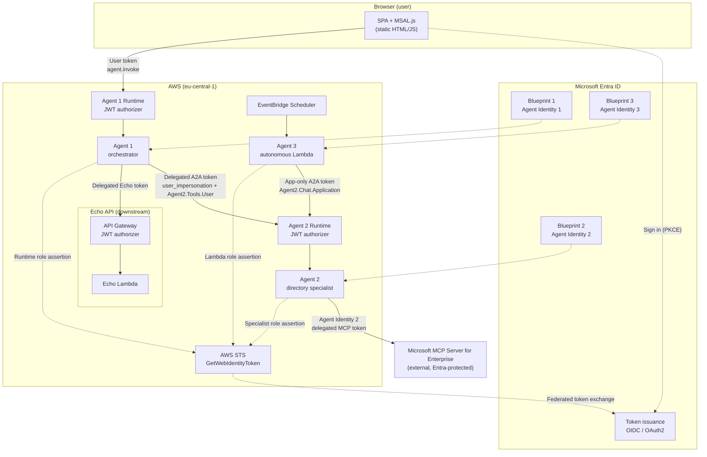

# Entra Agent ID on AWS Bedrock AgentCore

Proof of concept for three independently authenticated AI agents:


```mermaid
flowchart TD
    subgraph Browser["Browser (user)"]
        SPA["SPA + MSAL.js<br/>(static HTML/JS)"]
    end

    subgraph Entra["Microsoft Entra ID"]
        IDP["Token issuance<br/>OIDC / OAuth2"]
        BP1["Blueprint 1<br/>Agent Identity 1"]
        BP2["Blueprint 2<br/>Agent Identity 2"]
        BP3["Blueprint 3<br/>Agent Identity 3"]
    end

    subgraph AWS["AWS (eu-central-1)"]
        A1AUTH["Agent 1 Runtime<br/>JWT authorizer"]
        A1["Agent 1<br/>orchestrator"]
        A2AUTH["Agent 2 Runtime<br/>JWT authorizer"]
        A2["Agent 2<br/>directory specialist"]
        SCHED["EventBridge Scheduler"]
        A3["Agent 3<br/>autonomous Lambda"]
        STS["AWS STS<br/>GetWebIdentityToken"]

        subgraph EchoStack["Echo API (downstream)"]
            EAUTHZ["API Gateway<br/>JWT authorizer"]
            ECHO["Echo Lambda"]
        end
    end

    MCP["Microsoft MCP Server for Enterprise<br/>(external, Entra-protected)"]

    SPA -.->|"Sign in (PKCE)"| IDP
    SPA -->|"User token<br/>agent.invoke"| A1AUTH
    A1AUTH --> A1
    A1 -->|"Delegated A2A token<br/>user_impersonation + Agent2.Tools.User"| A2AUTH
    A2AUTH --> A2
    A2 -->|"Agent Identity 2<br/>delegated MCP token"| MCP
    A1 -->|"Delegated Echo token"| EAUTHZ
    EAUTHZ --> ECHO
    SCHED --> A3
    A3 -->|"App-only A2A token<br/>Agent2.Chat.Application"| A2AUTH

    A1 -.->|"Runtime role assertion"| STS
    A2 -.->|"Specialist role assertion"| STS
    A3 -.->|"Lambda role assertion"| STS
    STS -.->|"Federated token exchange"| IDP

    BP1 -.-> A1
    BP2 -.-> A2
    BP3 -.-> A3
```

All agents use the same Python ZIP, but each has a separate Entra Agent Identity
and AWS execution role. Credentials stay on the corresponding Blueprint as AWS
federated identity credentials (FICs).

## Authorization model

| Path | Token audience | Required authorization |
|---|---|---|
| SPA -> Agent 1 | Blueprint 1 | `agent.invoke` delegated scope |
| Agent 1 -> Agent 2 | Blueprint 2 | `user_impersonation` scope and `Agent2.Tools.User` user role |
| Agent 3 -> Agent 2 | Blueprint 2 | `Agent2.Chat.Application` application role |
| Agent 2 -> MCP | MCP server | Delegated MCP scopes |

Agent 2 enforces the claims above in application code. App-only calls can use only
the tool-free `chat` skill; only user-delegated calls can use directory/MCP tools.

## Entra objects

| Object | Purpose |
|---|---|
| SPA app registration | Signs in users and requests Blueprint 1's `agent.invoke` scope |
| Blueprint 1 + Agent Identity 1 | SPA-facing AgentCore orchestrator |
| Blueprint 2 + Agent Identity 2 | A2A directory specialist |
| Blueprint 3 + Agent Identity 3 | Autonomous Lambda caller |
| Echo API app registration | Demo downstream OBO resource |

Use [the Entra setup guide](docs/entra-setup-guide.md) to create the objects,
configure scopes and roles, consent delegated access, assign roles, and configure
FICs. Use [the deployment guide](docs/deployment-guide.md) to deploy AWS resources.

## Quick start

1. Create all three Blueprints and Agent Identities, the SPA registration, and the
   Echo API registration. Complete the grants in
   [the Entra setup guide](docs/entra-setup-guide.md).
2. Copy `.env.example` to `.env` and set the required values, including the four
   A2A values.
3. Enable AWS outbound identity federation once:

   ```powershell
   aws iam enable-outbound-web-identity-federation --profile agentid-poc
   ```

4. Deploy with A2A disabled from scheduling by default:

   ```powershell
   .\scripts\aws-deploy.ps1 -EnableA2A -AutonomousScheduleState DISABLED
   ```

5. Add/update the three Blueprint FICs using the execution-role ARNs printed by
   the deployment. Paste the printed Agent 1 invoke URL into
   `spa/msal-config.js`, then serve the SPA with `.\scripts\dev.ps1`.
6. Manually invoke Agent 3 only after the interactive and delegated flows work.
   Enable its five-minute schedule when ready.

## Repository layout

| Path | Purpose |
|---|---|
| [agent/](./agent/) | Agent 1, Agent 2, Agent 3, token exchange, and authorization code |
| [spa/](./spa/) | MSAL.js SPA that invokes Agent 1 |
| [infra/](./infra/) | CloudFormation stack |
| [scripts/](./scripts/) | Build, deploy, authentication, and teardown scripts |
| [docs/](./docs/) | Setup, deployment, A2A, and local-development guidance |

## Notes

- `aws-deploy.ps1` creates a timestamped Agent 1 runtime on every deployment.
  Update `agentCoreEndpoint` in local `spa/msal-config.js` after each deployment.
- The SPA calls only AgentCore; it never calls Echo or MCP directly.
- Tokens are not logged or passed to the model. FIC diagnostics log only
  non-secret assertion metadata and should be disabled after troubleshooting.
- AgentCore, Lambda, Scheduler, and Bedrock usage can incur AWS charges.

## Related guides

- [Entra setup](docs/entra-setup-guide.md)
- [Deployment](docs/deployment-guide.md)
- [A2A setup and demonstrations](docs/a2a-setup-guide.md)
- [SPA local development](docs/spa-local-dev-notes.md)
