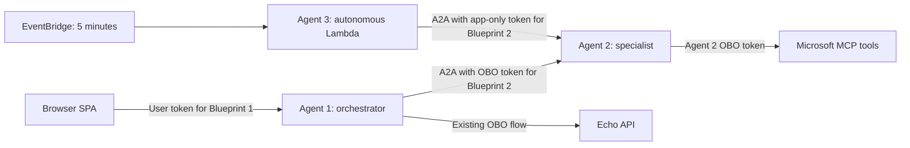

# A2A extension: three agents, two authorization modes

This branch replaces Agent 1's direct MCP integration with delegation to Agent 2.
The SPA URL and response shape remain unchanged; Echo remains a tool on Agent 1.
Agent 2 is a native A2A AgentCore Runtime, not an ECS service. Agent 3 is a
Strands agent in Lambda, invoked by an optional five-minute EventBridge schedule.
All three use the same ARM64 Python ZIP in S3, but separate Entra identities and
AWS execution roles. No ECR repository or deployment container image is required.



## Authorization contract

| Request | Audience | Caller (`azp`) | Required permission | Execution |
|---|---|---|---|---|
| SPA to Agent 1 | Blueprint 1 client ID | Existing SPA | Existing AgentCore scope | Orchestration |
| Agent 1 to Agent 2 | Blueprint 2 client ID | Agent Identity 1 client ID | `scp` includes `user_impersonation` AND `roles` includes `Agent2.Tools.User` | `directory` or `chat` |
| Agent 3 to Agent 2 | Blueprint 2 client ID | Agent Identity 3 client ID | No `scp`; `roles` includes `Agent2.Chat.Application`; `oid` equals Agent Identity 3 | `chat` only |
| Agent 2 to MCP | MCP resource | Agent Identity 2 | Existing delegated MCP scopes | MCP tools |

The AgentCore authorizer for Agent 2 checks issuer and audience without requiring
a global delegated scope. AgentCore performs an internal, headerless Agent Card
fetch before forwarding an invocation, so `/.well-known/agent-card.json` must not
be blocked by application middleware. External Agent Card requests remain protected
by AgentCore's authorizer. For JSON-RPC requests, Agent 1 also supplies the bearer
token in `X-Amzn-Bedrock-AgentCore-Runtime-Custom-Authorization`; Agent 2 validates
that explicitly allowlisted header for RS256 signature, issuer, audience, expiry
and required claims, then enforces the table above. Missing/invalid invocation
credentials receive HTTP 401; missing permissions receive HTTP 403.
Both bare Blueprint 2 client IDs and
`api://{blueprint-2-client-id}` audiences are accepted, because Entra can emit
either form for this resource.

If AgentCore reports HTTP 424, inspect Agent 2's runtime logs. A loopback Agent Card
request with no headers is normal; it must return HTTP 200. For JSON-RPC requests,
the application logs only safe authentication metadata—whether the runtime custom
authorization header and bearer token arrived, plus the validation exception
type—without logging a token.
An authenticated app-only caller requesting `directory` receives an A2A JSON-RPC
error before any model, token exchange, or MCP call.

`chat` constructs a new agent with an empty tool list. It does not discover MCP
tools or request an MCP token. An instruction in a prompt cannot enable tools.
Tokens stay in request-scoped closures/context, never messages, model prompts,
Agent Cards, or logs. Agent 1 cannot request MCP tokens through its tools.

The implementation uses A2A 0.3 `message/send` and returns a final `Message`.
It advertises no streaming or push notification support and does not implement
long-lived task continuation. Clients use a fresh AgentCore session per interaction,
authenticate Agent Card retrieval, and send bearer tokens only to the configured
runtime, never to an arbitrary URL from discovery.

## Entra configuration

Use the same tenant for all three agents. Existing SPA and Echo registrations
remain in place. [The Entra setup guide](entra-setup-guide.md) is the canonical
setup for all three Blueprints, Agent Identities, grants, roles, and AWS federation.

1. Create Blueprint 2 / Agent Identity 2 and Blueprint 3 / Agent Identity 3.
   Create each BlueprintPrincipal in the tenant.
2. On Blueprint 2, set `identifierUris` to `api://{blueprint-2-client-id}`, set
   `api.requestedAccessTokenVersion` to `2`, expose `user_impersonation`, and
   define the two roles below.
3. On the Blueprint 2 **resource service principal**, assign
   `Agent2.Tools.User` to demonstration users or groups. A Blueprint 1 role does
   not appear in a Blueprint 2 token.
4. Create `oauth2PermissionGrants` for Agent Identity 1 -> Blueprint 2
   (`user_impersonation`) and Agent Identity 2 -> MCP (`MCP_SERVER_SCOPE`).
   `requiredResourceAccess` alone does not grant consent.
5. Assign `Agent2.Chat.Application` on the Blueprint 2 resource service principal
   to **Agent Identity 3**, not to the SPA or a human.
6. Configure Blueprint 2 and 3 FICs with `SpecialistRoleArn` and
   `AutonomousRoleArn` from the stack outputs.

Each scope/role needs its own generated GUID. Merge these role definitions into
Blueprint 2's manifest rather than replacing unrelated properties:

```json
{
  "appRoles": [
    {
      "id": "<new-user-role-guid>",
      "value": "Agent2.Tools.User",
      "displayName": "Use Agent 2 directory tools",
      "description": "Use directory tools through Agent 2 on behalf of a user.",
      "allowedMemberTypes": ["User"],
      "isEnabled": true
    },
    {
      "id": "<new-application-role-guid>",
      "value": "Agent2.Chat.Application",
      "displayName": "Call Agent 2 without tools",
      "description": "Allow an autonomous agent to request tool-free responses.",
      "allowedMemberTypes": ["Application"],
      "isEnabled": true
    }
  ]
}
```

For an administrator using Microsoft Graph, the application role assignment is:

```http
POST https://graph.microsoft.com/v1.0/servicePrincipals/{agent-3-identity-id}/appRoleAssignments
Content-Type: application/json

{
  "principalId": "<agent-3-identity-id>",
  "resourceId": "<blueprint-2-resource-service-principal-object-id>",
  "appRoleId": "<new-application-role-guid>"
}
```

For direct user assignment, POST the equivalent body to
`/users/{user-id}/appRoleAssignments`, with `principalId` set to that user ID
and `appRoleId` set to the user-role GUID. Resource **object IDs** in assignments
are different from the Blueprint **client IDs** used as token audiences.
Use an appropriately privileged administrator; application roles and delegated
consent are independent grants.

The token chain is:

```text
SPA -> Tc (aud=Blueprint1)
Agent1: AWS role1 -> Blueprint1 FMI(T1) -> OBO(Tc) -> T12 (aud=Blueprint2)
Agent2: AWS role2 -> Blueprint2 FMI(T1) -> OBO(T12) -> TMCP (aud=MCP)

Agent3: AWS role3 -> Blueprint3 FMI(T1) -> client_credentials
        scope=api://{Blueprint2}/.default -> T32 (aud=Blueprint2, app-only)
```

Agent 2's user assertion must be audienced to **Blueprint 2** for the second OBO
exchange. Do not forward the original SPA token to Agent 2 or forward T12 to MCP.
Use `(tid, oid)` to correlate a user across resources; `sub` is audience-specific.

## Build and deploy

Fill the four new IDs in `.env` from `.env.example`. Neither code changes nor a
local build create these Entra objects or grants automatically.

On this host, Python package downloads must run inside **WSL**, not Windows.
Run the Linux build script from PowerShell, then deploy the resulting ZIP without
invoking the Windows build helper:

```powershell
wsl -d Ubuntu-24.04 --cd "$PWD" --exec bash scripts/build-zip.sh
if ($LASTEXITCODE -ne 0) { throw "WSL build failed." }
.\scripts\aws-deploy.ps1 -SkipZipBuild -EnableA2A -AutonomousScheduleState DISABLED
```

This downloads Linux ARM64 wheels and creates `build\agent-runtime.zip` without
Docker or ECR. Cross-platform pip on Windows alone does not reliably evaluate
Linux dependency markers. The existing Docker-based helper remains available for
other environments, but is not used for this host.

The script uploads one versioned ZIP for all agents. It verifies all entry modules
are included, no Python bytecode is included, and the uncompressed package fits
the 250 MB limit. Agent 2 starts `specialist.py` on port 9000; Lambda uses
`autonomous.handler`. A second in-place CloudFormation update publishes the
allocated Agent 2 runtime URL into its Agent Card without a circular reference.
Agent 2 is invoked at its runtime URL without a `qualifier`; unlike Agent 1, it
does not have a `RuntimeEndpoint` resource.

An ordinary redeploy preserves existing A2A and schedule parameters when omitted.
On a new stack, A2A is disabled unless requested, and the schedule is disabled by
default. **In this branch Agent 1 no longer has direct MCP access even when A2A
is disabled**: Echo and general chat work, while a directory tool request reports
that Agent 2 must be configured. Deploy the extension to restore directory access.

Configure these FIC subjects with the existing AWS account issuer and audience
`api://AzureADTokenExchange`:

| Blueprint | Stack output containing the exact subject |
|---|---|
| 1 | `ExecutionRoleArn` (unchanged) |
| 2 | `SpecialistRoleArn` |
| 3 | `AutonomousRoleArn` |

Do not substitute assumed-role ARNs or runtime ARNs. Each Blueprint must trust
only its intended AWS role. Once migration works, revoke Agent 1's old MCP
delegated grant/inheritance while retaining its Echo grant.

## Demonstration

Start with the schedule disabled. Manually invoke Agent 3 using the
`AutonomousFunctionName` output:

```powershell
aws lambda invoke --profile agentid-poc --region eu-central-1 `
  --function-name "<AutonomousFunctionName>" `
  --cli-binary-format raw-in-base64-out `
  --payload '{"prompt":"Explain one benefit of agent-to-agent collaboration."}' `
  response.json
```

Inspect both `FunctionError` in the CLI result and the response file: AWS returning
HTTP 200 for an invocation does not prove the agent succeeded. This call uses AWS
IAM only to trigger Agent 3; the subsequent A2A request uses Entra OAuth.

Then ask the SPA a directory question. Agent 1 delegates via A2A and Agent 2
performs its own OBO exchange to the same MCP server. The application does not
claim success when a downstream authentication failure occurs.

| Demonstration | Expected result |
|---|---|
| Authorized user through Agent 1 | Agent 2 directory response from MCP |
| Agent 3 with assigned app role | Plain Agent 2 response, no MCP access |
| User without Agent 2 user role | Rejected |
| Agent 1 without delegated consent | Entra token exchange rejected |
| Agent 3 without application role | Token issuance or Agent 2 authorization rejected |
| App-only token requesting `directory` | A2A error, no model or MCP call |
| Expired token, wrong issuer/audience, forged signature | Rejected |

Permission removal is not immediate revocation of already-issued tokens. Use
fresh sessions/tokens and allow existing access tokens to expire when demonstrating
grant removal. FMI and client-credentials tokens use MSAL's in-process caches;
delegated exchanges use each request's actual inbound assertion.

After the manual scenarios work:

```powershell
.\scripts\aws-deploy.ps1 -SkipZipBuild -AutonomousScheduleState ENABLED
# Stop recurring calls:
.\scripts\aws-deploy.ps1 -SkipZipBuild -AutonomousScheduleState DISABLED
```

The schedule runs every five minutes. It has no delivery retries, and Lambda
asynchronous retries are also disabled. Delivery failures and failed asynchronous
executions go to the encrypted `AutonomousFailureQueueUrl` queue. Agent 3 has a
240-second timeout and reserved concurrency of one. Monitor CloudWatch logs and
the queue during the demo; scheduling generates Bedrock usage charges.

Agent 2 logs mode, caller ID, user/agent object ID, skill, and request correlation
ID after authorization. Treat identity metadata and directory results as tenant
data and apply appropriate log access/retention policies. Never log access tokens.
Entra secures the application-to-application hops; AWS IAM still secures Lambda
invocation, scheduling, and Bedrock model access.

## Local regression tests

```powershell
wsl -d Ubuntu-24.04 --cd "$PWD" --exec bash -lc `
  'python3 -m venv build/venv-wsl && build/venv-wsl/bin/python -m pip install -r agent/requirements.txt && build/venv-wsl/bin/python -m unittest discover -s tests -v'
```

The tests use locally signed JWTs, mocked Entra/Bedrock/MCP interactions, and the
real A2A SDK/ASGI server. They do not replace a tenant-level demonstration of
consent, Blueprint role issuance, AWS federation, or chained OBO.

## References

- [AgentCore A2A deployment](https://docs.aws.amazon.com/bedrock-agentcore/latest/devguide/runtime-a2a.html)
- [AgentCore direct code deployment](https://docs.aws.amazon.com/bedrock-agentcore/latest/devguide/runtime-get-started-code-deploy.html)
- [Entra Agent ID OBO](https://learn.microsoft.com/en-us/entra/agent-id/agent-on-behalf-of-oauth-flow)
- [Autonomous agent authentication and authorization](https://learn.microsoft.com/en-us/entra/agent-id/autonomous-agent-authentication-authorization-flow)
